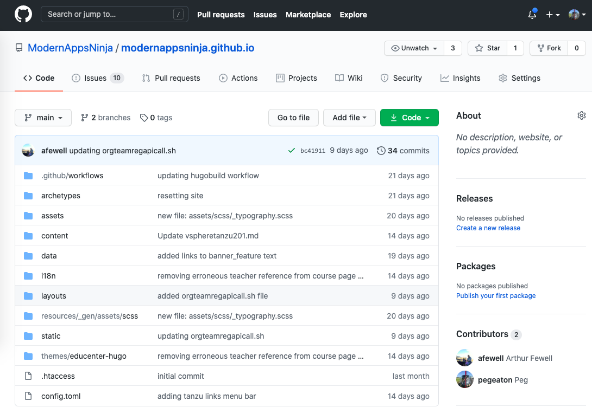
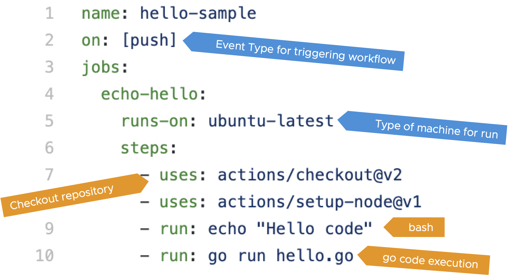
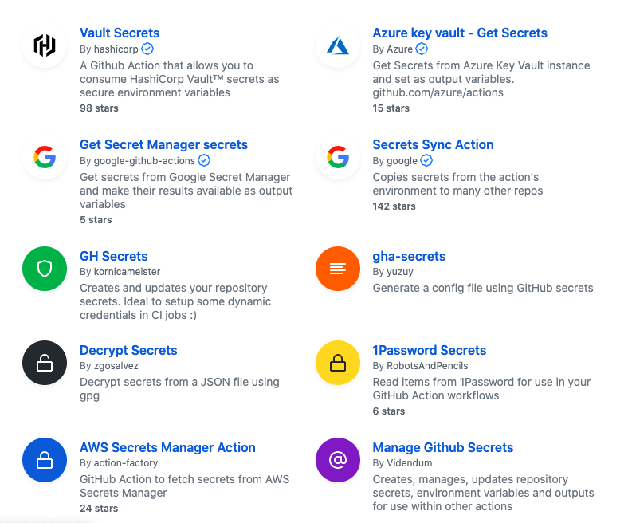
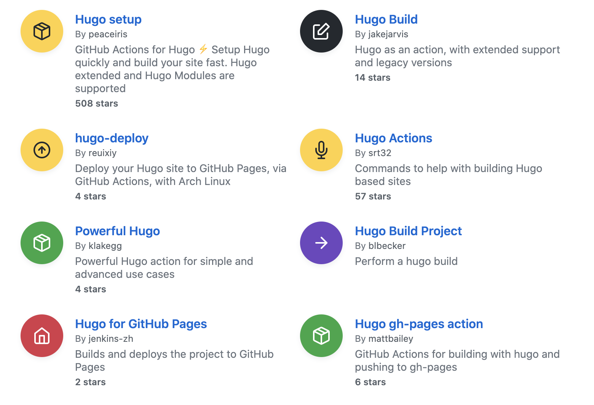

# Part 1: GitHub Actions and the Modern Apps Ninja Repository
In this blog, we explore GitHub Actions and GitHub Actions in the Modern Apps Ninja community repository:
* Modern Apps Ninja Community and Repository
* GitHub Actions
* GitHub Actions Marketplace: An Ecosytem of GitHub Actions

## Modern Apps Ninja Community and Repository
The [Modern Apps Ninja](https:https://modernapps.ninja/) learning community consists of students and professional cloud native practitioners, learning and working together to apply new cloud native technologies skills. A collaborative, community-driven approach to developing and curating content is fundamental to the program mission.  Community members develop the key content, including: courses, labs and hackathons focused on modern applications and application platforms.  Experiential learning opportunities are provided through [GitOps](https://www.youtube.com/watch?v=r50tRQjisxw) methodologies embedded throughout courses and on-going administration of the program.

### GitHub 
[GitHub](https://github.com) is more than a source code control system, it is truly a collaboration platform. GitHub is well documented and there are many different tutorials to help you get started.  One of my favorites is the [GitHub Learning Lab](https://lab.github.com/). Check it out and join the [Modern Apps Ninja](https:https://modernapps.ninja/) community!

### Modern Apps Ninja GitHub repository
The content, membership, and overall [Modern Apps Ninja](https:https://modernapps.ninja/) program is supported through GitHub.  The [Modern Apps Ninja GitHub repository](https://github.com/ModernAppsNinja/modernappsninja.github.io) is a public repository available for anyone to view; the repository contains lab guides, course content, and admnistrative materials.

<!---

-->

In addition, the [modernapps.ninja](https://lms.modernapps.ninja/) learning management system (edX platform) is also used for delivering free courses.

### The need for automated workflows
Automation is necessary to ensure consistent operations and rapid delivery of software supporting the program. Workflows are used to improve quality and efficiency when delivering code to production. For example, the site https://modernapps.ninja/ is fully automated and automatically generated from GitHub. The automation helps with standarization efforts and testing. While there are many CI/CD supporting technologies (Tekton pipelines, Jenkins, etc.) the use of GitHub Actions has a number of benefits, even at the most basic, free subscription level, including: 
* 2,000 Actions minutes/month are free for public repositories
* 500MB of GitHub Packages storage free for public repositories
* fully integrated into GitHub
* GitHub Actions workflow run on GitHub hosted virtual machines or self-hosted machines

As students and practioners of Cloud Native technologies, members often contribute lab guides for a variety of technology areas. 
Contributors submit content to the GitHub repository and are engaged in a gitops process. Contributions take many different forms including: creating issue tickets, resolving issues, making pull requests, creating GitHub Actions to support CI/CD, technical writing, and code development. 
The experiential learning is a key principle of the program.  Providing members an opportunity to advance not only their cloud native knowledge but practice gitops skills by actively engaging in the community. 

## GitHub Actions
[GitHub Actions](https://docs.github.com/en/free-pro-team@latest/actions) are powerful workflow tools built right into GitHub. GitHub Actions workflows are used to automate tasks within a repository and execution is triggered by events. GitHub Actions support many different types of event which trigger workflows, including push, pull_request, issues, etc. 

Let's take a look at the structure of a simple GitHub Actions workflow that does two things: (1) runs a bash command to echo the classic "Hello World!" statement and (2) runs a go program to display "Hello World!".  The purpose is to get a sense of the major parts of the anatomy and understand the power of and flexibility of each area of the workflow. We continue to dive deeper into these areas in subsequents articles. 

<!---

-->

As you can see in the graphic, the file contains:
* the name of the GitHub Actions: hello-sample 
* the event type: push (when a commit is made in this repository the workflow will run -- event type identifies the trigger for execution)
* jobs: name of the jobs to be queued for execution (in this case only a single job)
* the job name: echo-hello
* runs-on: ubuntu-latest - indicates the type of machine and version to be used for executing the job
* uses: checks out the repository (or download and install packages)
* run: indicates code to execute

Workflows are located in a .github/workflows directory within a repository; the definition file uses YAML syntax.  The workflow YAML file definitions have an enormous set of options to support CI/CD pipelines. For example, there are many different event types to trigger execution, including push, pull-requests, issue creation, etc.

## GitHub Marketplace: An Ecosytem of GitHub Actions
The [GitHub Marketplace](https://github.com/marketplace) provides a venue for creators to share GitHub Actions with the GitHub community. The following graphics show examples of GitHub Actions for secrets and for hugo (static website generator). 

### GitHub Marketplace Secrets Example
<!---

-->

### GitHub Marketplace Hugo Example
                      
marketplace-hugo.png
                                                          
## GitHub Actions in the Modern Apps Ninja repository

* Advantages and Disadvantages of using ecosystem workflows
* GitHub Actions used in the Ninja repository
* Recommendations for repository administrators
marketplace graphic — show secrets

The modernapps.ninja website is supported through a [hugo](https://gohugo.io/) framework.

* Benefits for contributors and administrators

