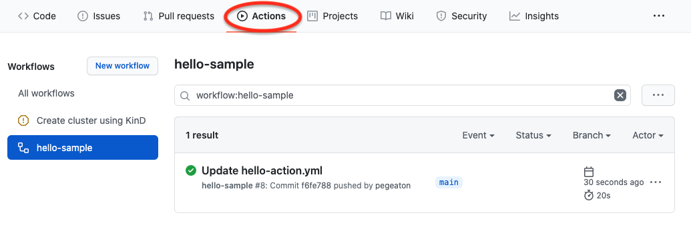

# Part2: Dive Deeper into GitHub Actions

Let's take a hands-on approach and walk-through creating the hello world program and GitHub Actions workflow together.  
This set of exercises assumes the reader has used a source code control system like GitHub to create repositories with source code. The GitHub documentation (https://docs.github.com/) is available as a reference as needed throughout the exercise.

In this excercise you will create a GitHub repository containing three files: README.md, hello.go, and hello-action.yml.  The file structure is shown in the following diagram:

## 1. Create a GitHub Account
Create a GitHub account, if you have not done so already.  

In our example, the account is **pegeaton**

## 2. Create a repository 
Create a **samples** repository within your GitHub account.  The repository is used to store your files.

## 2. Create a README.md within the repository 
Create a *README.md* file (we will use this later) in the repository containing the following:

		# Samples Repository
		This repository contains examples:
		* hello.go code example
		* hello-action.yml example

## 3. Create a simple test program written in go
Create a file called *hello.go* within your samples repository containing the following code:

   		package main
			import (
				"fmt"
			)

			func main() {
				fmt.Println("Hello, world.")
			}

This code will be run by the GitHub Action workflow on a push operation.

## 4. create directory to contain the GitHub Actions
Create a workflow directory within your repository called *.github/workflows*

## 5. create a simple GitHub Actions workflow
Create a file called *hello-action.yml* within the workflows directory (.github/workflows/hello-action.yml)
containing the following code:

	name: hello-sample
	on: [push]
	  jobs:
  	    echo-hello:
    	      runs-on: ubuntu-latest
    		steps:
      		- uses: actions/checkout@v2
      		- uses: actions/setup-node@v1
      		- run: echo "Hello code"
      		- run: go run hello.go    

Your workflows directory may look like the following after creating the file:

Remember this action runs on *any* push within the repository therefore the commit of the file triggered the workflow! Let's take a look at the run in the next section and be sure to **disable the workflow** since this is only a demonstration and you don't really want it to run with every push. 

## Reviewing GitHub Actions Activity

Select the Actions tab in the samples repository.

Then select the *hello-action.yml* link to display the results of running the action.

Notice the *on: [push]* indicates the action will be run on a push event within the repository. The commit of the hello-action.yml is a push event that triggered the action.  We can view the result of the push on the Actions tab. 

The runner is an application that executes the GitHub Actions jobs as defined in the GitHub Actions workflow. The runner can be hosted as in this example; the runner *runs-on* an ubuntu environment. (See the GitHub documentation for self-hosted runner.) 

## Examples: Modern Apps Ninja GitHub Actions
* Workflow Runner
* Handling Secrets
* Versioning
* Troubleshooting GitHub Actions
* Testing GitHub Actions
* Testing considerations

## Automated Assignment Evaluation
1. Contributor completes assignment file
2. Contributor submits a pull request for assignment file to the Modern Apps Ninja course repository
3. GitHub Action verify-assignment is triggered to run
3.1 If assignment results are correct the pull request is closed
3.2 If the assignment results are incorrect the error is posted to the pull request for modification.

3-4 graphics

